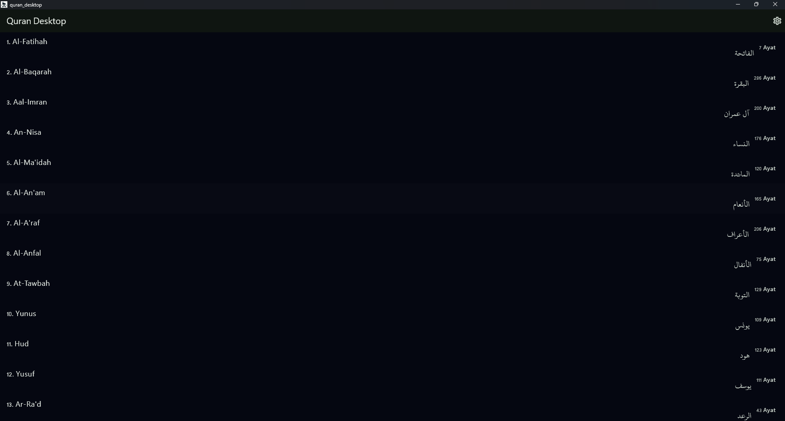
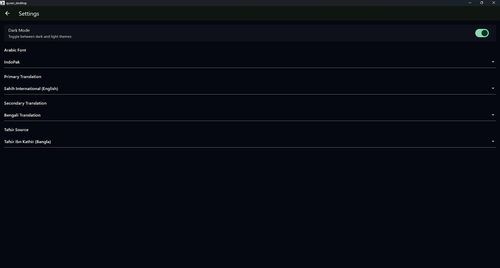
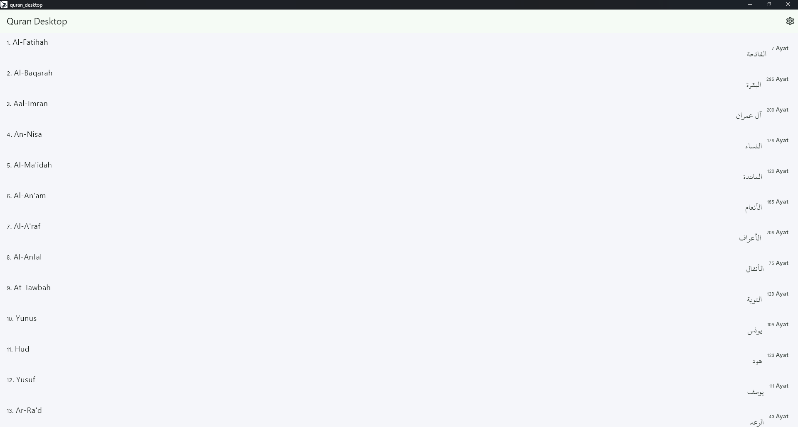

# 🕌 Quran Desktop App  
### A Modern, Fast & Beautiful Quran Reader for Windows

---

## 📖 About the Project

**Quran Desktop App** is a modern, minimal and elegant **Windows Quran reader**, inspired by Quran.com, designed for personal use but fully open for contributors.  
It provides a clean, typography-focused Quran experience with authentic Mushaf fonts, translations, tafsir, night mode, and smooth performance.

---

## ✨ Features

### 🕌 Complete Holy Quran  
Read all 114 Surahs with accurate Uthmani script (Mushaf Al-Madina).

### 🔤 Authentic Arabic Fonts  
Includes 4 high-quality Quran fonts:

- **KFGQPC Uthmani Script Hafs** (official Madinah Mushaf font)
- **IndoPak Nastaleeq**
- **Amiri Quran**
- **Scheherazade New**

### 🌐 Dual Translations  
Choose **two translations at once** (e.g., English + Bangla).

### 📚 Tafsir Support  
Show tafsir for any Ayah using Quran.com API:  
- Ibn Kathir (EN/BN)  
- Ahsanul Bayan (BN)  
- Abu Bakar Zakaria (BN)

### 🌙 Dark & Light Themes  
Modern Material 3 theming with theme switcher.

### 💾 Offline Caching  
Ayat, translations, and tafsir stored locally via SQLite.

### 🚀 Modern UI  
Clean, fast, and minimal UI inspired by Quran.com.

---

## 🛠 Built With

- **Flutter** (Desktop)
- **Dart**
- **VS Code**
- **Riverpod**
- **SQLite (sqflite_common_ffi)**
- **Quran.com API v4**
- **AI Tools Used:**  
  - ChatGPT (design, architecture, bug fixing)  
  - GitHub Copilot (code suggestion & scaffolding)

---

## 📥 Installation (Windows)

### 1️⃣ Install Flutter SDK  
https://flutter.dev  
Add Flutter to PATH:

```
C:\path\to\flutter\bin
```

Verify:

```
flutter --version
```

---

### 2️⃣ Install Visual Studio Build Tools  
Required for compiling Windows desktop apps.  
Install “Desktop Development with C++”.

---

### 3️⃣ Install Git  
https://git-scm.com/

---

### 4️⃣ Clone the Project

```
git clone https://github.com/rizwansammo/quran_desktop.git
cd quran_desktop
```

---

### 5️⃣ Install Dependencies

```
flutter pub get
```

---

### 6️⃣ Run the App

```
flutter run -d windows
```

---

### 7️⃣ Build Windows EXE

```
flutter build windows
```

Executable will be inside:

```
build/windows/x64/runner/Release/
```

---

## 📂 Project Structure

```
quran_desktop/
 ├── assets/
 │    └── screenshots/
 │         ├── surah_list.png
 │         ├── settings_screen.png
 │         └── light_mode.png
 │    └── fonts/
 ├── lib/
 │    ├── main.dart
 │    └── src/
 │         ├── app.dart
 │         ├── models/
 │         ├── providers/
 │         ├── services/
 │         ├── screens/
 │         └── widgets/
 └── README.md
```

---

## 🌐 API Integration

The app uses the official **Quran.com API v4**:

- Ayat:
  ```
  GET /api/v4/verses/by_chapter/{surah}
  ```

- Translations:
  ```
  GET /api/v4/verses/by_key/{surah}:{ayah}/translations?translations=ID1,ID2
  ```

- Tafsir:
  ```
  GET /api/v4/tafsirs/{tafsir_id}/by_ayah/{surah}:{ayah}
  ```

API documentation:  
https://quran.api-docs.io/

---

## 🎨 Fonts Setup

Place fonts inside:

```
assets/fonts/
```

And add to `pubspec.yaml`:

```yaml
fonts:
  - family: Uthmani
    fonts:
      - asset: assets/fonts/Uthmani.otf
  - family: IndoPak
    fonts:
      - asset: assets/fonts/IndoPak.ttf
  - family: AmiriQuran
    fonts:
      - asset: assets/fonts/AmiriQuran.ttf
  - family: Scheherazade
    fonts:
      - asset: assets/fonts/ScheherazadeNew.ttf
```

---

## 🤝 Contributing

Contributions are welcome!

You can help with:

- UI/UX improvements  
- More tafsir integrations  
- Audio recitation  
- Search feature  
- Bookmarks & notes  
- Performance improvements  

### How to Contribute

1. Fork the repo  
2. Create a branch  
3. Commit changes  
4. Push and create a Pull Request  

---

## 🛣 Upgrade Plan

- [ ] Audio Recitations  
- [ ] Mushaf Page View Mode  
- [ ] Ayah Search  
- [ ] Bookmarks & Notes  
- [ ] Auto-scroll reading mode  
- [ ] Multi-language UI  

---

## 📜 License

MIT License- free to modify, use, and distribute.

---

## ❤️ Acknowledgments

- Quran.com API   

---

<div align="center">

### ⭐ If you find this project useful, please star the repository!

</div>

<div align="center">

#### Screenshots:

</div>
<div align="center">

<br/>

<br/>

</div>
